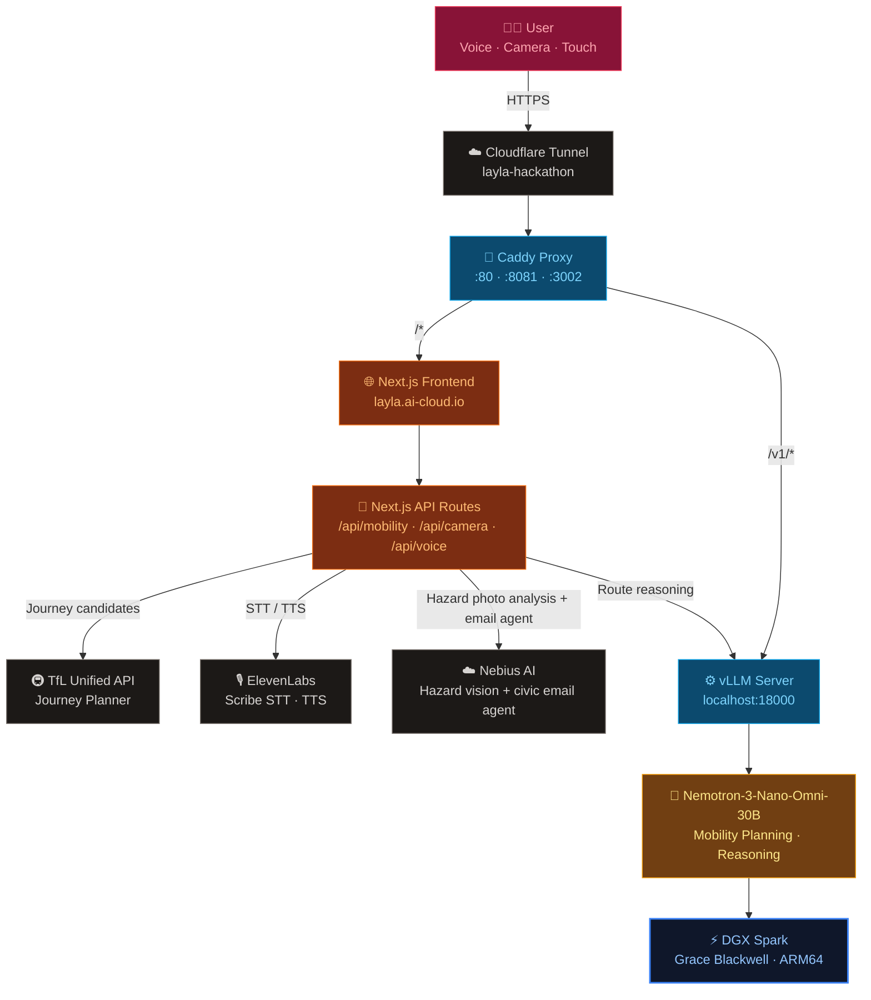
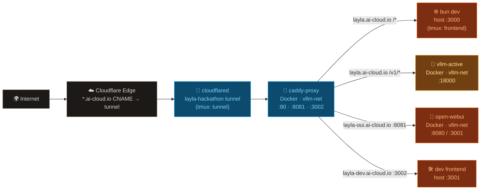
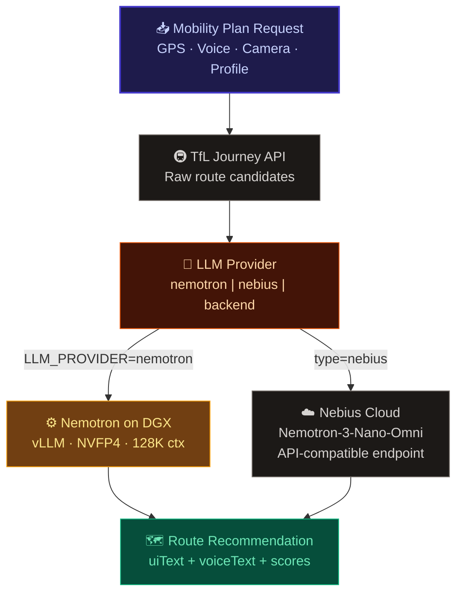

# 🧭 Layla

**Voice-first navigation assistant for people with special mobility needs.**
Built at the NVIDIA Hack for Impact, London, on a DGX Spark running Nemotron-3-Nano-Omni-30B.

Layla listens, sees, and reasons — combining multimodal AI, live Transport for London data, real-time hazard detection via camera, and ElevenLabs voice I/O to guide users along the safest, most accessible route.

---

## 🗺️ Architecture Overview



---

## 🗂️ Repository Structure

```
layla/
├── frontend/                  # Next.js 16 app (TypeScript, Bun)
│   ├── app/
│   │   ├── page.tsx           # Main UI — map, voice, camera, route cards
│   │   ├── layout.tsx
│   │   └── api/
│   │       ├── mobility/plan/ # Core planning endpoint (TfL + LLM)
│   │       ├── camera/report/ # Gemini hazard photo analysis + email
│   │       ├── camera/stream/ # Real-time camera frame processing
│   │       └── voice/         # ElevenLabs STT token, TTS, session
│   ├── components/            # UI components
│   ├── hooks/                 # React hooks (geolocation, routes, voice)
│   └── lib/                   # Business logic
│       ├── mobility/          # TfL route fetching, LLM planning, prompt
│       ├── camera/            # Hazard detection, voice commands
│       ├── voice/             # TTS scripts, conversation memory
│       ├── agent/             # LLM provider abstraction (Nemotron/Gemini/backend)
│       └── config/env.ts      # Server env validation
├── backend/
│   └── NemoClaw/              # NVIDIA NemoClaw — AI agent sandbox runner
├── scripts/
│   ├── nano-image-chat.py     # Multimodal image chat CLI (Nebius / DGX)
│   ├── .env.example           # Environment template
│   ├── assets/                # Test images
│   ├── cloudflare/            # Caddy + named tunnel setup
│   └── dgx/                   # vLLM and Open WebUI startup scripts
└── README.md
```

---

## 🌐 Network & Infrastructure

### Public URLs

| URL | Routes to | Purpose |
|---|---|---|
| `https://layla.ai-cloud.io/` | Next.js `:3000` | Main app — demo entry point |
| `https://layla.ai-cloud.io/v1/` | vLLM `:18000` | OpenAI-compatible inference API |
| `https://layla.ai-cloud.io/oui/` | Open WebUI `:8080` | OUI via subpath (may have asset issues) |
| `https://layla-oui.ai-cloud.io/` | Open WebUI `:8081` | Open WebUI — stable root path |
| `https://layla-dev.ai-cloud.io/` | Caddy `:3002` → host `:3001` | Colleague dev frontend |

All traffic flows through a **single named Cloudflare Tunnel** (`layla-hackathon`) → **Caddy reverse proxy** (Docker), which routes by hostname and path prefix.

### Infrastructure Diagram



### Docker Network

All containers share the `vllm-net` bridge network — internal DNS resolution by container name (no IPs needed).

| Container | Image | Network | Ports | Restart |
|---|---|---|---|---|
| `vllm-active` | `vllm/vllm-openai:v0.20.0-aarch64-cu130` | `vllm-net` | `18000` | `unless-stopped` |
| `open-webui` | `ghcr.io/open-webui/open-webui` | `vllm-net` | `3001→8080` | `unless-stopped` |
| `caddy-proxy` | `caddy:alpine` | `vllm-net` + host bridge | `80`, `8081`, `3002` | `unless-stopped` |

---

## 🧠 AI / Inference Stack



### Model

| Property | Value |
|---|---|
| Model | `nvidia/Nemotron-3-Nano-Omni-30B-A3B-Reasoning-NVFP4` |
| Quantisation | NVFP4 (~15 GB VRAM) |
| Context | 128K tokens |
| Modalities | Text + Image (multimodal) |
| Thinking mode | Optional (`enable_thinking: true/false`) |
| Endpoint | OpenAI-compatible `/v1/chat/completions` |

### LLM Provider Routing (`LLM_PROVIDER`)

| Value | Model | Use case |
|---|---|---|
| `nemotron` | Nemotron-3-Nano-Omni-30B on DGX vLLM | Default — on-device, no cloud cost |
| `nebius` | Nemotron-3-Nano-Omni via Nebius cloud | Cloud fallback (`--type nebius` in scripts) |
| `backend` | NemoClaw backend API | Custom backend mobility contract |

---

## 🖥️ Frontend

**Next.js 16**, TypeScript, Bun. App Router with server-side API routes.

### Components

| Component | Purpose |
|---|---|
| `VoicePanel` | ElevenLabs Scribe STT mic + TTS playback |
| `CameraPanel` | `getUserMedia` live camera stream, hazard capture |
| `RouteMap` | Leaflet map, route polylines, accessibility scores |
| `MobilityAgentPanel` | Route cards, persona selector, planning trigger |
| `GeminiInputPanel` | Text/LLM input panel |
| `RouteCard` | Single route display — steps, scores, voice guide |
| `ChangeTimeline` | Real-time event / disruption timeline |
| `EventSimulator` | Inject synthetic city events for demo |
| `AccessibilityLayer` | Screen-reader and ARIA accessibility wrapper |

### API Routes

| Route | Method | Description |
|---|---|---|
| `/api/mobility/plan` | POST | Fetch TfL routes → LLM ranking → scored recommendations |
| `/api/mobility/compare` | POST | Multi-persona route comparison overlay |
| `/api/camera/report` | POST | Gemini vision analysis of hazard photo → optional email |
| `/api/camera/stream` | POST | Real-time camera frame hazard scoring |
| `/api/voice/speak` | POST | ElevenLabs TTS — speak plan voiceText |
| `/api/voice/session` | POST | ElevenLabs ConvAI session token |
| `/api/voice/scribe-token` | POST | ElevenLabs Scribe STT token |
| `/api/crime-incidents` | GET | City of London crime incident feed |

### User Profiles

| Profile | Description |
|---|---|
| `general` | Standard pedestrian |
| `blind` | Maximises audio cues, avoids complex crossings |
| `wheelchair` | Step-free only, lift availability |
| `elderly` | Slower pace, avoids stairs and crowds |
| `custom` | User-defined priority |

### Priority Options

`fastest` · `least_stressful` · `most_accessible` · `most_reliable`

---

## ⚙️ Environment Variables

### `frontend/.env.local`

| Variable | Required | Description |
|---|---|---|
| `TFL_APP_KEY` | ✅ | TfL Unified API key |
| `NEMOTRON_BASE_URL` | ✅ | vLLM base URL (`https://layla.ai-cloud.io`) |
| `NEMOTRON_MODEL` | — | Model name (default: Nemotron-3-Nano-Omni-30B-NVFP4) |
| `LLM_PROVIDER` | — | `nemotron` \| `gemini` \| `backend` (default: `nemotron`) |
| `GEMINI_API_KEY` | — | Google Gemini — optional hazard vision fallback |
| `ELEVENLABS_API_KEY` | ✅ | ElevenLabs — Scribe STT + TTS |
| `ELEVENLABS_VOICE_ID` | — | TTS voice ID |
| `BACKEND_API_URL` | — | NemoClaw backend (if `LLM_PROVIDER=backend`) |
| `RESEND_API_KEY` | — | Email hazard reports via Resend |

### `scripts/.env`

| Variable | Set by | Description |
|---|---|---|
| `NEBIUS_API_KEY` | manual | Nebius cloud inference key |
| `CLOUDFLARE_API_TOKEN` | manual | Tunnel + DNS edit permissions |
| `TUNNEL_NAME` | `setup-named-tunnel.sh` | `layla-hackathon` |
| `TUNNEL_HOSTNAME` | `setup-named-tunnel.sh` | `layla.ai-cloud.io` |
| `GATEWAY_URL` | `setup-named-tunnel.sh` | `https://layla.ai-cloud.io` |

---

## 🚀 Daily Startup

```bash
cd /home/nvidia/_github/charles-cai/layla/scripts

# 1. vLLM (GPU — start first, takes ~60s to load)
./dgx/nemotron-nano-omni-30b-nvfp4.sh

# 2. Open WebUI
./dgx/open-webui.sh

# 3. Caddy reverse proxy
./cloudflare/caddy.sh

# 4. Frontend (tmux — survives SSH disconnects)
tmux new-session -s frontend -d 'cd frontend && bun dev'

# 5. Cloudflare tunnel (tmux)
tmux new-session -s tunnel -d './cloudflare/run-named-tunnel.sh'
```

Check sessions:
```bash
tmux ls
# frontend: 1 windows
# tunnel:   1 windows

tmux attach -t frontend   # Ctrl+B, D to detach
tmux attach -t tunnel     # Ctrl+B, D to detach
```

Verify:
```bash
curl https://layla.ai-cloud.io/v1/models        # vLLM
curl https://layla.ai-cloud.io/                 # Frontend
docker ps --filter name=caddy-proxy --format "{{.Status}}"
```

---

## 🔧 Scripts

### `scripts/nano-image-chat.py`

Multimodal image-to-text CLI. Sends an image to Nemotron and prints the response.

```bash
# Nebius cloud (default)
python3 nano-image-chat.py assets/police-road-block-AG3Y12.jpg

# Local DGX vLLM
python3 nano-image-chat.py assets/police-road-block-AG3Y12.jpg --type dgx

# Custom prompt
python3 nano-image-chat.py assets/police-road-block-AG3Y12.jpg "Any hazards visible?" --type dgx
```

### `scripts/dgx/`

| Script | Description |
|---|---|
| `nemotron-nano-omni-30b-nvfp4.sh` | Start `vllm-active` container; optional `thinking=1` arg |
| `open-webui.sh` | Start `open-webui` container on `vllm-net` |

### `scripts/cloudflare/`

| Script | Run | Description |
|---|---|---|
| `setup-named-tunnel.sh` | One-time | Create tunnel, write `cloudflared.yml`, route DNS |
| `run-named-tunnel.sh` | Daily (tmux) | Run the named tunnel — stable URL, no rotation |
| `caddy.sh` | Daily | Start `caddy-proxy` Docker container |
| `cloudflared-tunnel.sh` | Ad-hoc | Quick single-port tunnel (no Caddy, no auth) |

---

## 🐳 One-Time Setup

### 1. Install cloudflared (ARM64 / DGX Spark)

```bash
sudo mkdir -p --mode=0755 /usr/share/keyrings
curl -fsSL https://pkg.cloudflare.com/cloudflare-main.gpg | sudo tee /usr/share/keyrings/cloudflare-main.gpg >/dev/null
echo "deb [signed-by=/usr/share/keyrings/cloudflare-main.gpg] https://pkg.cloudflare.com/cloudflared any main" | sudo tee /etc/apt/sources.list.d/cloudflared.list
sudo apt-get update && sudo apt-get install cloudflared
```

### 2. Authenticate cloudflared

```bash
cloudflared tunnel login   # opens browser — select ai-cloud.io zone
```

### 3. Create named tunnel

```bash
cd scripts
cp .env.example .env
# edit .env: set CLOUDFLARE_API_TOKEN, NEBIUS_API_KEY
./cloudflare/setup-named-tunnel.sh
```

### 4. Frontend env

```bash
cd frontend
cp .env.local.example .env.local
# edit .env.local: set TFL_APP_KEY, GEMINI_API_KEY, ELEVENLABS_API_KEY
# set NEMOTRON_BASE_URL=https://layla.ai-cloud.io
```

---

## 🏗️ Hardware

| Component | Spec |
|---|---|
| Machine | NVIDIA DGX Spark |
| GPU | Grace Blackwell (GB10) |
| Architecture | ARM64 (aarch64) |
| OS | Ubuntu Linux |
| Kernel | 6.17.0-1021-nvidia |
| Driver | NVIDIA 570+ |
| Docker runtime | `nvidia-container-runtime` |

---

## 📦 Backend — NemoClaw

`backend/NemoClaw/` is an NVIDIA open-source reference stack for running always-on AI agents (OpenClaw, Hermes) inside OpenShell sandboxes with network policy enforcement and credential sanitization. It is used by Layla as the optional `LLM_PROVIDER=backend` inference pathway.

See [`backend/NemoClaw/CLAUDE.md`](backend/NemoClaw/CLAUDE.md) for full architecture and contribution guide.

---

## Changelog

| Date | Author | Description | Version |
|---|---|---|---|
| 2026-06-06 | Yilin Lee | Initial comprehensive architecture + infrastructure README | 0.1 |
