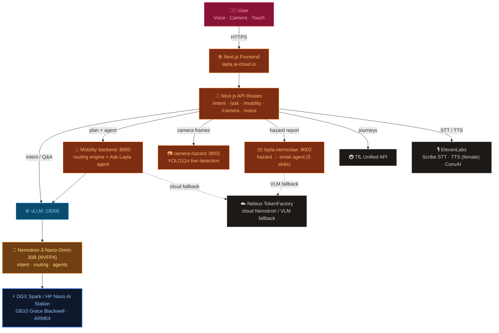

# 🧭 Layla — Accessibility Mobility Intelligence

**A voice-first mobility assistant for people the maps forget** — blind and low-vision travellers,
wheelchair users, older people, and anyone walking home at night.
Built at **NVIDIA Hack for Impact, London**, on a **DGX Spark / HP Nano AI Station (GB10 Grace
Blackwell)** running **Nemotron-3-Nano-Omni-30B (NVFP4)**.

Most maps optimise the *fastest* route for an able-bodied person. For a wheelchair user a flight of
steps is a dead end; for a blind person a crossing with no tactile paving is a risk; at night a dark,
high-crime street matters more than three minutes saved. **Layla plans the route that's right for
*you*, guides you there out loud, sees the street when you can't, and lets anyone improve the city —
all running on-device, on the edge.**

| Pillar | What it does |
|---|---|
| 🗺️ **PLAN** a route for who you are | "From Barbican to Bank — I use a wheelchair" → a step-free, crime-aware route + spoken turn-by-turn (female voice). |
| 💬 **ASK** Layla anything | A **NemoClaw agent** (Nemotron orchestrates the `layla-data` skill tools) answers open questions — "Is it safe around Bank and is the tube running?" — from real ingested open data. |
| 📷 **SEE** the street & **IMPROVE** the city | Live **YOLO** hazard detection on the phone camera → a **NemoClaw agent** locates the hazard, finds the responsible council, and drafts the report email. |

**Track:** Public Services. **Bounties:** Nemotron ✓ · ElevenLabs ✓.

---

## ✨ What makes it different

- **Re-routes per persona, doesn't re-rank.** Different edge costs → a *different optimal path* for
  `blind` / `wheelchair` / `elderly` / `night_safety`, not just a re-sorted list.
- **Three-layer accessibility.** TfL step-free (transit) + OSM street features (kerbs / tactile / steps)
  + **live lift outages** that correct TfL's static step-free assumption.
- **Routing fuses open data, not just an API.** We ingest raw London open data on-device — OSM footways
  with per-edge accessibility, ~92k police crime points, DEFRA road-noise, London-Air quality, live TfL —
  and fuse it into one **weighted graph** so users can make informed trade-offs.
- **Agentic, not hardcoded.** "Ask Layla" and the hazard report are **agent loops**: Nemotron decides
  which **NemoClaw skill** tools to call (chaining several when needed) and answers with real numbers.
- **On-device on the edge.** Nemotron (NVFP4, ~15 GB, 128K ctx) runs locally via vLLM — no cloud
  round-trip for the core planner; voice/camera/GPS never have to leave the device.

---

## 🗺️ Architecture



All traffic flows through a single **Cloudflare named tunnel** → **Caddy** reverse proxy
(`/v1/*` → vLLM, `/mobility/*` → backend, `/*` → frontend). The browser only talks to the public URL;
Next.js API routes proxy to the backends server-side.

---

## 🧩 Services

| Service | Port | Runs in | Purpose |
|---|---|---|---|
| Frontend (Next.js 16, Bun) | `3000` | tmux `frontend` | UI + API routes |
| Mobility backend | `8000` | tmux `mobility-backend` | `layla-routing` engine + **Ask-Layla agent** (`/agent/ask`, `/lookup`, `/mobility/plan`) |
| camera-hazard | `8001` | tmux `cam-hazard` | **YOLO11n** real-time road-hazard detection |
| layla-nemoclaw | `8002` | tmux `nemoclaw` | hazard → **email** agent (5 skills) |
| vLLM (Nemotron) | `18000` | Docker `vllm-active` | OpenAI-compatible inference |
| Caddy + Cloudflare tunnel | `80` | Docker + tmux `tunnel` | public HTTPS — `https://layla.ai-cloud.io` |

> The mobility backend and both agents are **standalone Python** that call Nemotron directly — they
> package work as **NemoClaw skills** but do not require the OpenClaw gateway daemon.

---

## 🗂️ Repository Structure

```
layla/
├── frontend/                       # Next.js 16 (TypeScript, Bun, Tailwind 4, Leaflet)
│   ├── app/
│   │   ├── page.tsx                # UI — map, voice, Ask Layla, camera, route cards
│   │   └── api/
│   │       ├── intent/             # voice → Nemotron route/question classifier
│   │       ├── ask/                # "Ask Layla anything" — NemoClaw agent (+ direct fallback)
│   │       ├── mobility/{plan,compare}/
│   │       ├── camera/{frame,hazard/start,report}/   # YOLO frames + hazard report (→ :8001/:8002)
│   │       └── voice/{speak,scribe-token,...}/        # ElevenLabs STT/TTS
│   ├── components/                 # VoicePanel · AskLaylaPanel · CameraPanel · RouteMap · …
│   ├── hooks/                      # useNavigation · useVoiceSpeak · useCameraStream · …
│   └── lib/                        # mobility / camera / voice / agent / navigation logic
├── backend/
│   ├── NemoClaw/skills/
│   │   ├── layla-data/             # fused open-data skill (8 tools) + ingested datasets
│   │   └── layla-routing/          # persona-weighted graph search, scoring, server, Ask-Layla agent
│   ├── camera-hazard/              # YOLO11n hazard service (:8001)
│   └── layla-nemoclaw/             # hazard → email agent + 5 skills (:8002)
├── scripts/                        # dgx (vLLM) + cloudflare (Caddy / named tunnel)
├── docs/submission-form/           # Hack-for-Impact submission write-up
└── README.md
```

---

## 🧠 AI Models

| Model | Role | Where |
|---|---|---|
| **Nemotron-3-Nano-Omni-30B-A3B-Reasoning-NVFP4** | Primary multimodal reasoning — route ranking/explanation, voice-intent parsing, "Ask Layla" agent, hazard reasoning. 128K ctx, ~15 GB VRAM. | **on-device**, vLLM `:18000` |
| **Nemotron-3-Nano-Omni** via **Nebius TokenFactory** | Cloud fallback for the same model (same wire format). | cloud |
| **Qwen2.5-VL** | Hazard image analysis in `layla-nemoclaw` (on-device skill; Nebius `Qwen2.5-VL-72B` fallback). | on-device / cloud |
| **Ultralytics YOLO11n** | Live per-frame hazard detection (~300 ms cadence, proximity-scored stop/continue). | `camera-hazard` :8001 |
| **ElevenLabs** | **Scribe** streaming STT, **TTS** (British female "Alice"), ConvAI turn-taking. | cloud |

Same OpenAI-compatible client targets on-device vLLM, Nebius cloud, or a NemoClaw backend via
`LLM_PROVIDER = nemotron | nebius | backend`.

### Agents (NemoClaw skills + Nemotron)
- **Ask Layla** (`/agent/ask` → `layla_agent.py`): a ReAct loop — Nemotron picks `layla-data` tools
  (`area_info`, `transit_status`), runs them, and answers with the real numbers. The UI surfaces which
  tools were called.
- **Hazard report** (`layla-nemoclaw`, 5 skills): `analyse-image` → `resolve-location` (Nominatim) →
  `search-authority` (council search) → `prepare-content` → `prepare-email`, streamed to the UI over SSE.

---

## 🗺️ Personalised Routing

Ingested **London open data**, fused per-edge into one walkable graph:

| Layer | Source | Coverage |
|---|---|---|
| Walkable graph + accessibility (steps, kerbs, tactile paving, crossings) | OpenStreetMap | central-London corridor |
| Crime (~92k points) | Met + City of London Police | Greater London |
| Noise (road dB bands) | DEFRA | City of London |
| Air quality | London Air (LAQN) | London (coarse) |
| Live transit / lift outages / disruptions / crowding | TfL Unified API | London |

**5 scoring signals** — accessibility · safety · quiet · lighting · air — are weighted per persona &
preference, then a Dijkstra search yields a *different geometry per traveller*. An optional
**cuGraph + RMM** GPU backend exists for the graph compute (CPU Dijkstra is the default/fallback).

| Profiles | Priorities |
|---|---|
| `general` · `blind` · `wheelchair` · `elderly` · `night_safety` | `most_accessible` (Personalised) · `fastest` · `most_reliable` · `least_stressful` |

---

## 📷 Camera Hazard → Civic Email

```
phone camera ──frames──▶ camera-hazard :8001 (YOLO11n)
        └─ hazard detected ─▶ layla-nemoclaw :8002 agent
              analyse-image (VLM) → resolve-location (Nominatim)
              → search-authority (council) → prepare-content → prepare-email → SSE to UI
```
One snapshot becomes a council-ready report email. A **demo mode** (`LAYLA_NEMOCLAW_DEMO=1`,
`CAMERA_HAZARD_DEMO`) skips heavy model loads for a safe live demo.

---

## ⚙️ Environment (`frontend/.env.local`)

| Variable | Required | Description |
|---|---|---|
| `TFL_APP_KEY` | ✅ | TfL Unified API key |
| `ELEVENLABS_API_KEY` | ✅ | Scribe STT + TTS |
| `NEMOTRON_BASE_URL` | ✅ | vLLM base URL — `http://localhost:18000` on the Spark; public URL elsewhere |
| `BACKEND_API_URL` | ✅ | Mobility backend — `http://localhost:8000` on the Spark |
| `NEMOTRON_MODEL` | — | default `nvidia/Nemotron-3-Nano-Omni-30B-A3B-Reasoning-NVFP4` |
| `ELEVENLABS_VOICE_ID` | — | TTS voice (default **Alice**, British female) |
| `LAYLA_NEMOCLAW_URL` / `LAYLA_NEMOCLAW_DEMO` | — | hazard agent URL (`:8002`) / demo mode |
| `CAMERA_HAZARD_API_URL` | — | YOLO service (`:8001`) |
| `LLM_PROVIDER` | — | `nemotron` (default) \| `nebius` \| `backend` |
| `NEBIUS_API_KEY` · `RESEND_API_KEY` | — | cloud fallback inference · send the hazard email |

---

## 🚀 Daily Startup (DGX Spark)

```bash
cd /home/nvidia/_github/charles-cai/layla

scripts/dgx/nemotron-nano-omni-30b-nvfp4.sh                                   # 1. vLLM (GPU, ~60s)
tmux new-session -s tunnel  -d 'cd scripts && ./cloudflare/run-named-tunnel.sh'  # 2. public HTTPS
tmux new-session -s mobility-backend -d 'bash backend/NemoClaw/skills/layla-routing/run.sh'  # 3. routing + agent
tmux new-session -s cam-hazard -d 'cd backend/camera-hazard && YOLO_DEVICE=cpu PORT=8001 .venv/bin/python server.py'  # 4. YOLO
tmux new-session -s nemoclaw   -d 'cd backend/layla-nemoclaw && LAYLA_NEMOCLAW_DEMO=1 PORT=8002 .venv/bin/python server.py'  # 5. email agent
tmux new-session -s frontend   -d 'cd frontend && bun dev'                    # 6. frontend
```

Verify:
```bash
curl https://layla.ai-cloud.io/v1/models                                          # vLLM
curl -X POST https://layla.ai-cloud.io/api/ask -H 'Content-Type: application/json' \
  -d '{"question":"Is it safe around Bank and is the tube running?"}'             # Ask-Layla agent
```

---

## 🏗️ Hardware

| Component | Spec |
|---|---|
| Machine | NVIDIA DGX Spark / HP Nano AI Station |
| GPU | GB10 Grace Blackwell · 128 GB unified LPDDR5X |
| Arch | ARM64 (aarch64), CUDA 13 |
| Serving | `vllm/vllm-openai:v0.20.0-aarch64-cu130`, NVFP4, 128K context |

---

## 👥 Team — Hack for Impact, London

| Member | Focus |
|---|---|
| Yilin Li | Data pipeline + routing engine + Ask-Layla agent |
| Yao Gong | Frontend + vision model + hazard pipeline |
| Ningqian Yang | Voice navigation |
| Mark Xiaoyi Sun | Agent + on-device inference |
| Charles Cai | Architecture + open data |

## Changelog

| Date | Description | Version |
|---|---|---|
| 2026-06-06 | Initial architecture + infrastructure README | 0.1 |
| 2026-06-07 | Final product: Ask-Layla NemoClaw agent, fused-open-data persona routing, real YOLO11n hazard → civic-email agent, female voice, edge-local Nemotron | 1.0 |
