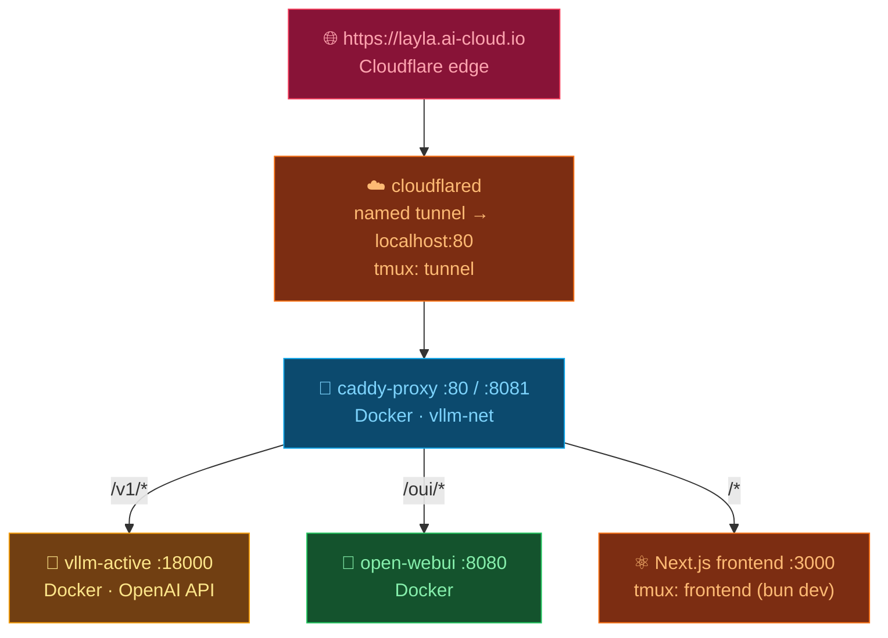

# 🚀 DGX Spark — vLLM · Caddy · Cloudflare

Concise **startup** and **diagnostic** runbook for bringing the stack back up after a
DGX Spark reboot, and for triaging it when a route is down.

> **TL;DR after reboot:** the 3 Docker services auto-restart themselves. You only need to
> relaunch the **frontend** and the **cloudflare tunnel** in tmux.

---

## 🧭 Architecture



---

## 📦 Services at a glance

| Service | Runs in | Port(s) | Survives reboot? | Start command |
|---|---|---|---|---|
| 🧩 vLLM | Docker `vllm-active` | `18000` | ✅ `--restart unless-stopped` | `scripts/dgx/nemotron-nano-omni-30b-nvfp4.sh` |
| 💬 Open WebUI | Docker `open-webui` | `8080` (host `3001`) | ✅ `--restart unless-stopped` | `scripts/dgx/open-webui.sh` |
| 🔀 Caddy | Docker `caddy-proxy` | `80`, `8081` | ✅ `--restart unless-stopped` | `scripts/cloudflare/caddy.sh` |
| ⚛️ Frontend | tmux `frontend` | `3000` | ❌ tmux only | `cd frontend && bun dev` |
| ☁️ Cloudflare tunnel | tmux `tunnel` | — | ❌ tmux only | `scripts/cloudflare/run-named-tunnel.sh` |

All Docker services share the `vllm-net` bridge network. The frontend runs on the **host**,
reached by Caddy via `host.docker.internal:3000`.

---

## 🔁 After a reboot (the only commands you need)

```bash
cd /home/nvidia/_github/charles-cai/layla

# Frontend — survives SSH disconnect
tmux new-session -s frontend -d 'cd frontend && bun dev'

# Cloudflare named tunnel — stable URL https://layla.ai-cloud.io
tmux new-session -s tunnel  -d 'cd scripts && ./cloudflare/run-named-tunnel.sh'

tmux ls   # → frontend: 1 windows / tunnel: 1 windows
```

If a Docker service did **not** come back (rare), re-run its script — in order:

```bash
cd /home/nvidia/_github/charles-cai/layla/scripts
./dgx/nemotron-nano-omni-30b-nvfp4.sh   # vLLM
./dgx/open-webui.sh                      # Open WebUI
./cloudflare/caddy.sh                    # Caddy
```

---

## 🩺 Diagnostics — one-shot health check

```bash
echo "vLLM   :18000 → $(curl -s -o /dev/null -w '%{http_code}' http://localhost:18000/v1/models)"
echo "Front  :3000  → $(curl -s -o /dev/null -w '%{http_code}' http://localhost:3000)"
echo "Caddy  :80    → $(curl -s -o /dev/null -w '%{http_code}' http://localhost:80)"
echo "Public        → $(curl -s -o /dev/null -w '%{http_code}' https://layla.ai-cloud.io/)"
docker ps --format '{{.Names}}\t{{.Status}}'
tmux ls
```

**Healthy = all `200`**, three containers `Up`, two tmux sessions present.

---

## 🚨 Symptom → cause → fix

| Symptom | Likely cause | Fix |
|---|---|---|
| Caddy `:80` returns **502**, vLLM is `200` | Frontend (`/*` route) is down | `tmux new-session -s frontend -d 'cd frontend && bun dev'` |
| Public URL fails, `localhost:80` is `200` | Tunnel not running | `tmux new-session -s tunnel -d 'cd scripts && ./cloudflare/run-named-tunnel.sh'` |
| `tmux ls` → *no server running* | Sessions died (reboot/crash) | Re-run both tmux commands above |
| vLLM `:18000` not `200` | Container down / still loading weights | `docker logs -f vllm-active` (model load takes ~1–2 min) |
| Public URL `530`/`1033` | Tunnel up but no origin, or DNS | check `tunnel` tmux log; ensure Caddy `:80` is `200` |
| OUI assets 404 at `/oui/` | SvelteKit absolute asset paths | use fallback `http://<host>:8081/` |
| Caddy `502` on `/v1/*` | vLLM container off `vllm-net` | confirm `docker network inspect vllm-net` lists `vllm-active` |

---

## 🔍 Logs & inspection

```bash
# Docker services
docker logs -f vllm-active
docker logs -f caddy-proxy
docker logs -f open-webui

# tmux sessions (Ctrl+B, D to detach)
tmux attach -t frontend
tmux attach -t tunnel

# GPU / memory (model is ~15 GB NVFP4 on 128 GB unified)
nvidia-smi
```

---

## 🌐 Endpoints

| Access | URL |
|---|---|
| Public (auth) | `https://layla.ai-cloud.io/` · `…/v1/models` |
| Intranet frontend | `http://10.18.216.16/` |
| Intranet vLLM API | `http://10.18.216.16/v1/` |
| Intranet OUI | `http://10.18.216.16/oui/` (fallback `:8081`) |
| Local vLLM (direct) | `http://localhost:18000/v1/models` |

Basic-auth credentials (`CADDY_USER` / password) live in `scripts/.env`. Full tunnel/Caddy
setup details: [scripts/cloudflare/README.md](../../scripts/cloudflare/README.md).

---

## 📋 Changelog

| Date | Author | Description of Change | Version |
|---|---|---|---|
| 2026-06-06 | charles-cai | Initial startup + diagnostics runbook | 1.0 |
