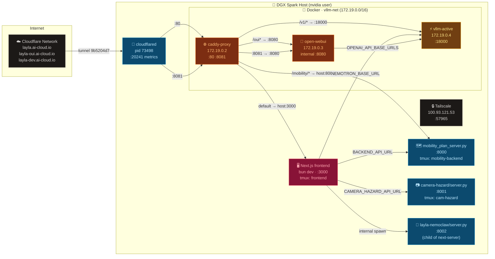

# 🚀 Layla — Production Deployment Reference

> **DGX Spark** (`dgx1`, ARM64, GB10 GPU, 128 GB unified memory) · Ubuntu 24.04

---

## 🗺️ Architecture Overview



---

## 🌐 Public Hostnames

| Hostname | Tunnel target | Caddy routes to |
|---|---|---|
| `layla.ai-cloud.io` | `http://localhost:80` | See port 80 routing table below |
| `layla-oui.ai-cloud.io` | `http://localhost:8081` | `open-webui:8080` (Open WebUI direct) |
| `layla-dev.ai-cloud.io` | `http://localhost:3002` | ⚠️ Port 3002 **not exposed** by caddy.sh — currently unreachable |
| `*.ai-cloud.io` | `http://localhost:80` | Fallback to Caddy :80 |

---

## 🔀 Caddy Routing (`:80`)

Config: `scripts/cloudflare/Caddyfile`

| Path pattern | Upstream | Notes |
|---|---|---|
| `/v1/*` | `vllm-active:18000` | vLLM OpenAI-compat API |
| `/oui*` | `open-webui:8080` | Open WebUI (strips `/oui` prefix) |
| `/mobility/*` | `host.docker.internal:8000` | Mobility plan backend |
| _(default)_ | `host.docker.internal:3000` | Next.js frontend |

---

## 📋 Port Reference

| Port | Bind | Protocol | Service | Process / Container |
|---|---|---|---|---|
| `80` | `0.0.0.0` | HTTP | Caddy reverse proxy | `caddy-proxy` (Docker) |
| `3000` | `*` | HTTP | Next.js frontend | `next-server` (bun dev) |
| `3001` | `0.0.0.0` | HTTP | Open WebUI | `open-webui` (Docker) |
| `3002` | _(none)_ | — | Caddy internal only — **not exposed to host** | — |
| `8000` | `0.0.0.0` | HTTP | Mobility plan server | `mobility_plan_server.py` |
| `8001` | `0.0.0.0` | HTTP | Camera hazard YOLO server | `camera-hazard/server.py` |
| `8002` | `0.0.0.0` | HTTP | Layla NemoClaw agent server | `layla-nemoclaw/server.py` |
| `8081` | `0.0.0.0` | HTTP | Caddy → Open WebUI direct | `caddy-proxy` (Docker) |
| `18000` | `0.0.0.0` | HTTP | vLLM OpenAI API | `vllm-active` (Docker) |
| `20241` | `127.0.0.1` | HTTP | cloudflared metrics | `cloudflared` pid 73498 |
| `57965` | `100.93.121.53` | TCP | Tailscale direct-connect | `tailscaled` |
| `11000` | `127.0.0.1` | — | Internal (unidentified) | — |

---

## 🐳 Docker Containers

All containers share Docker network **`vllm-net`** (bridge, `172.19.0.0/16`).

### ⚡ `vllm-active` — Nemotron Inference

| Field | Value |
|---|---|
| Image | `vllm/vllm-openai:v0.20.0-aarch64-cu130-ubuntu2404` |
| Status | `Up` · `--restart unless-stopped` |
| Port | `0.0.0.0:18000->18000/tcp` |
| IP (vllm-net) | `172.19.0.4` |
| Start script | `scripts/dgx/nemotron-nano-omni-30b-nvfp4.sh` |
| Model | `nvidia/Nemotron-3-Nano-Omni-30B-A3B-Reasoning-NVFP4` |

**Full launch command:**
```bash
docker run -d --gpus all --ipc=host \
  --restart unless-stopped \
  --name vllm-active \
  --network vllm-net \
  -e NVIDIA_DRIVER_CAPABILITIES=compute,utility \
  -e VLLM_NVFP4_GEMM_BACKEND=marlin \
  -e VLLM_USE_FLASHINFER_MOE_FP4=0 \
  -v /home/nvidia/.cache/huggingface:/root/.cache/huggingface \
  -v /home/nvidia/.cache/vllm-compile:/root/.cache/vllm \
  -p 18000:18000 \
  vllm/vllm-openai:v0.20.0-aarch64-cu130-ubuntu2404 \
    nvidia/Nemotron-3-Nano-Omni-30B-A3B-Reasoning-NVFP4 \
    --tensor-parallel-size 1 \
    --max-model-len 131072 \
    --max-num-seqs 256 \
    --reasoning-parser deepseek_r1 \
    --trust-remote-code \
    --moe-backend marlin \
    --gpu-memory-utilization 0.40 \
    --enable-auto-tool-choice \
    --tool-call-parser hermes \
    --limit-mm-per-prompt '{"image": 1, "video": 1}' \
    --port 18000
```

**Model volumes:**
- `/home/nvidia/.cache/huggingface` → weights cache
- `/home/nvidia/.cache/vllm-compile` → compiled kernel cache

**Key flags:**
- `--moe-backend marlin` — NVFP4 MoE backend for GB10/Blackwell
- `--gpu-memory-utilization 0.40` — leaves 60% for unified memory
- `--thinking` controlled via `chat-template-kwargs` (set `enable_thinking: true/false` in script arg 3)

---

### 🌐 `caddy-proxy` — Reverse Proxy

| Field | Value |
|---|---|
| Image | `caddy:alpine` (v2.11.4) |
| Status | `Up` · `--restart unless-stopped` |
| Ports | `0.0.0.0:80->80/tcp`, `0.0.0.0:8081->8081/tcp` |
| IP (vllm-net) | `172.19.0.2` |
| Start script | `scripts/cloudflare/caddy.sh` |
| Config mount | `scripts/cloudflare/Caddyfile:/etc/caddy/Caddyfile:ro` |

**Full launch command:**
```bash
docker run -d \
  --name caddy-proxy \
  --restart unless-stopped \
  --network vllm-net \
  --add-host=host.docker.internal:host-gateway \
  -p 80:80 \
  -p 8081:8081 \
  -v "$(realpath scripts/cloudflare/Caddyfile):/etc/caddy/Caddyfile:ro" \
  caddy:alpine
```

> **Note:** `--add-host=host.docker.internal:host-gateway` is required for Caddy to reach `host.docker.internal:3000` (Next.js) and `:8000` (mobility backend).

---

### 💬 `open-webui` — Open WebUI

| Field | Value |
|---|---|
| Image | `ghcr.io/open-webui/open-webui:main` |
| Status | `Up` · healthy · `--restart unless-stopped` |
| Port | `0.0.0.0:3001->8080/tcp` |
| IP (vllm-net) | `172.19.0.3` |
| Start script | `scripts/dgx/open-webui.sh` |
| Data volume | `open-webui-data:/app/backend/data` |

**Key env:**
```
OPENAI_API_BASE_URLS=http://vllm-active:18000/v1
OPENAI_API_KEY=dummy
WEBUI_AUTH=False
ENABLE_OLLAMA_API=False
```

---

## 🐍 Native Processes (nvidia user)

### 🔗 cloudflared — Tunnel

| Field | Value |
|---|---|
| PID | `73498` |
| Tmux session | `tunnel` |
| Start script | `scripts/cloudflare/run-named-tunnel.sh` |
| Config | `scripts/cloudflare/cloudflared.yml` |
| Credentials | `/home/nvidia/.cloudflared/9b5204d7-c974-425a-a6b1-9d6a6aa64a03.json` |
| Tunnel ID | `9b5204d7-c974-425a-a6b1-9d6a6aa64a03` |
| Tunnel name | `layla-hackathon` |
| Metrics | `http://127.0.0.1:20241/metrics` |

**Full command:**
```bash
cloudflared tunnel --config /home/nvidia/_github/charles-cai/layla/scripts/cloudflare/cloudflared.yml run
```

**How it was started:**
```bash
tmux new-session -s tunnel -d
# inside tunnel session:
cd scripts && ./cloudflare/run-named-tunnel.sh
```

The start script sources `scripts/.env` (exports `CLOUDFLARE_API_TOKEN`) before running cloudflared.

---

### 🗺️ mobility_plan_server.py — Route Planning Backend

| Field | Value |
|---|---|
| PID | `1295011` |
| Port | `0.0.0.0:8000` |
| Tmux session | `mobility-backend` |
| Working dir | `/home/nvidia/_github/charles-cai/layla/backend/NemoClaw/skills/layla-routing` |
| Start script | `backend/NemoClaw/skills/layla-routing/run.sh` |
| Python | `python3` (system, 3.12.3) |

**How to start:**
```bash
cd backend/NemoClaw/skills/layla-routing
./run.sh
# or manually:
export NEMOTRON_BASE_URL=http://localhost:18000
export PORT=8000
python3 mobility_plan_server.py
```

The `run.sh` script also removes `_graph_cache.pkl` on start (forces fresh graph build) and reads `TFL_APP_KEY` from `frontend/.env.local`.

---

### 📷 camera-hazard/server.py — YOLO Hazard Detection

| Field | Value |
|---|---|
| PID | `1347834` |
| Port | `0.0.0.0:8001` |
| Tmux session | `cam-hazard` |
| Working dir | `/home/nvidia/_github/charles-cai/layla/backend/camera-hazard` |
| Python venv | `.venv/` (Python 3.12.3) |
| Log file | `/tmp/cam_run.log` |

**How to start:**
```bash
cd backend/camera-hazard
CAMERA_HAZARD_DEMO=0 YOLO_DEVICE=cpu PORT=8001 .venv/bin/python server.py 2>&1 | tee /tmp/cam_run.log
```

**Env vars:**

| Variable | Current | Notes |
|---|---|---|
| `CAMERA_HAZARD_DEMO` | `0` | `1` = fake/demo responses, `0` = real YOLO |
| `YOLO_DEVICE` | `cpu` | `cuda:0` for GPU inference |
| `PORT` | `8001` | HTTP port |

---

### 🧠 layla-nemoclaw/server.py — NemoClaw Agent

| Field | Value |
|---|---|
| PID | `1365726` |
| Port | `0.0.0.0:8002` |
| Working dir | `/home/nvidia/_github/charles-cai/layla/backend/layla-nemoclaw` |
| Python venv | `.venv/` (Python 3.12.3) |
| Parent PID | `1349475` (next-server — spawned via a Next.js API route) |

**How to start manually:**
```bash
cd backend/layla-nemoclaw
.venv/bin/python server.py
# or
PORT=8002 python3 server.py
```

This process is currently spawned automatically by the Next.js server when the relevant API route is first called (see `frontend/app/api/`). In production it should be started independently in its own tmux window.

---

### 🖥️ Next.js Frontend

| Field | Value |
|---|---|
| PID | `1349475` (next-server), `1349447` (node wrapper), `1349442` (bun dev) |
| Port | `*:3000` |
| Tmux session | `frontend` |
| Working dir | `/home/nvidia/_github/charles-cai/layla/frontend` |
| Start command | `bun dev` |

**How to start:**
```bash
cd frontend
bun dev
```

**Key `.env.local` settings:**

| Variable | Value | Notes |
|---|---|---|
| `BACKEND_API_URL` | `http://localhost:8000` | Mobility plan server |
| `LLM_PROVIDER` | `nemotron` | LLM backend selection |
| `NEMOTRON_BASE_URL` | `http://localhost:18000` | vLLM endpoint |
| `NEMOTRON_MODEL` | `nvidia/Nemotron-3-Nano-Omni-30B-A3B-Reasoning-NVFP4` | Model ID |
| `CAMERA_HAZARD_API_URL` | `http://localhost:8001` | Camera hazard server |
| `NEXT_PUBLIC_VOICE_ENABLED` | `true` | ElevenLabs voice feature |
| `LAYLA_NEMOCLAW_DEMO` | `1` | NemoClaw demo mode |
| `CAMERA_HAZARD_FAKE_LOOP` | `false` | Use real camera frames |

---

## 🔒 Tailscale

Hostname: **`dgx1`** · IP: `100.93.121.53`

The host is reachable over Tailscale from any device on the tailnet. Direct SSH: `ssh nvidia@100.93.121.53` (port 22) or `ssh nvidia@dgx1`.

```
dgx1                   100.93.121.53   (this host, online)
iphone-13-pro-max      100.71.181.20   (iOS, seen 14h ago)
jess-macbook-pro       100.85.139.33   (macOS, seen 6h ago)
```

---

## 🖥️ tmux Sessions

| Session name | Content |
|---|---|
| `tunnel` | cloudflared named tunnel (persistent) |
| `mobility-backend` | mobility_plan_server.py on :8000 |
| `cam-hazard` | camera-hazard YOLO server on :8001 |
| `frontend` | Next.js `bun dev` on :3000 |
| `5`, `6` | Loose bash/monitoring shells (btop, nvtop etc.) |

**Reconnect to a session:**
```bash
tmux attach -t tunnel
tmux attach -t frontend
tmux attach -t mobility-backend
tmux attach -t cam-hazard
```

---

## 🔁 Startup Order

Services must start in this order due to dependencies:

```
1. vllm-active          (GPU must be free; takes ~3–5 min to load weights)
2. caddy-proxy          (needs vllm-net Docker network to exist)
3. open-webui           (needs vllm-net)
4. mobility_plan_server.py  (needs :18000 for route scoring, but can start before)
5. camera-hazard/server.py  (standalone, no deps)
6. layla-nemoclaw/server.py (standalone, no deps)
7. cloudflared tunnel   (needs :80 to be up to avoid tunnel errors)
8. Next.js frontend     (reads .env.local at startup)
```

**Quick full restart (all in tmux):**
```bash
# Rebuild Docker infra
scripts/dgx/nemotron-nano-omni-30b-nvfp4.sh    # recreates vllm-active
scripts/dgx/open-webui.sh                        # recreates open-webui
scripts/cloudflare/caddy.sh                      # recreates caddy-proxy

# Native services (in separate tmux windows)
tmux new-window -t tunnel -n mobility    'cd /home/nvidia/_github/charles-cai/layla && backend/NemoClaw/skills/layla-routing/run.sh'
tmux new-window -t tunnel -n cam-hazard  'cd /home/nvidia/_github/charles-cai/layla/backend/camera-hazard && CAMERA_HAZARD_DEMO=0 YOLO_DEVICE=cpu PORT=8001 .venv/bin/python server.py 2>&1 | tee /tmp/cam_run.log'
tmux new-window -t tunnel -n frontend    'cd /home/nvidia/_github/charles-cai/layla/frontend && bun dev'
```

---

## 🔍 Diagnostics

### Check all service health at once

```bash
# Docker containers
docker ps --format "table {{.Names}}\t{{.Status}}\t{{.Ports}}"

# Listening ports (native + Docker-mapped)
ss -tlnp | grep -E '80|3000|3001|8000|8001|8002|18000|20241'

# Tail all backend logs
docker logs -f vllm-active   # GPU inference
docker logs -f caddy-proxy   # proxy access log
docker logs -f open-webui    # WebUI
tail -f /tmp/cam_run.log     # camera hazard
```

### Test individual endpoints

```bash
# vLLM health
curl http://localhost:18000/health

# vLLM model list (through Caddy)
curl http://localhost/v1/models

# Mobility plan server
curl http://localhost:8000/health

# Camera hazard server
curl http://localhost:8001/health

# NemoClaw agent server
curl http://localhost:8002/health

# Cloudflare tunnel metrics
curl http://localhost:20241/metrics
```

### Cloudflared diagnostics

```bash
# Check tunnel status
cloudflared tunnel info layla-hackathon

# Live tunnel logs (tail from tmux)
tmux attach -t tunnel

# Restart tunnel
tmux send-keys -t tunnel C-c
tmux send-keys -t tunnel 'cd /home/nvidia/_github/charles-cai/layla/scripts && ./cloudflare/run-named-tunnel.sh' Enter
```

### Docker network issues

```bash
# Verify all containers are on vllm-net
docker network inspect vllm-net --format '{{range .Containers}}{{.Name}} {{.IPv4Address}}{{"\n"}}{{end}}'

# Test caddy → vllm routing inside Docker net
docker exec caddy-proxy wget -qO- http://vllm-active:18000/health

# Recreate network (if containers can't see each other)
docker network create vllm-net
# then restart containers with scripts/dgx/*.sh
```

### GPU / vLLM issues

```bash
# GPU utilization
nvtop      # interactive
nvidia-smi # snapshot

# vLLM startup log (watch for OOM or CUDA errors)
docker logs --tail 100 -f vllm-active

# vLLM is still loading weights if /health returns 503 — wait ~3–5 min
watch -n5 'curl -s http://localhost:18000/health'
```

---

## ⚠️ Known Issues

| # | Issue | Impact | Notes |
|---|---|---|---|
| 1 | `layla-dev.ai-cloud.io` → `:3002` unreachable | `layla-dev.ai-cloud.io` 502s | `caddy.sh` doesn't expose port 3002 to host; cloudflared can't reach it. Fix: add `-p 3002:3002` to `caddy.sh` |
| 2 | `layla-nemoclaw/server.py` spawned by Next.js | No independent lifecycle | Should run in its own tmux window. If Next.js restarts, the agent server dies |
| 3 | `CAMERA_HAZARD_DEMO=0 YOLO_DEVICE=cpu` | Slower inference | Switch to `YOLO_DEVICE=cuda:0` for GPU-backed detection if GPU memory allows |

---

## 📁 Key File Locations

| Path | Purpose |
|---|---|
| `scripts/cloudflare/Caddyfile` | Caddy reverse proxy routing rules |
| `scripts/cloudflare/cloudflared.yml` | Cloudflare Tunnel ingress rules + tunnel ID |
| `scripts/cloudflare/run-named-tunnel.sh` | Start cloudflared (use inside tmux) |
| `scripts/cloudflare/caddy.sh` | Start/recreate caddy-proxy Docker container |
| `scripts/dgx/nemotron-nano-omni-30b-nvfp4.sh` | Start/recreate vllm-active Docker container |
| `scripts/dgx/open-webui.sh` | Start/recreate open-webui Docker container |
| `backend/NemoClaw/skills/layla-routing/run.sh` | Start mobility plan server (:8000) |
| `backend/camera-hazard/server.py` | Camera hazard YOLO server (:8001) |
| `backend/layla-nemoclaw/server.py` | NemoClaw agent server (:8002) |
| `frontend/.env.local` | Frontend env — LLM endpoints, API keys |
| `scripts/.env` | Shared env — Cloudflare token, tunnel name |
| `/home/nvidia/.cloudflared/9b5204d7-*.json` | Tunnel credentials (do not delete) |
| `/home/nvidia/.cache/huggingface` | Model weights cache (~15 GB) |
| `/home/nvidia/.cache/vllm-compile` | vLLM compiled kernel cache |
| `/tmp/cam_run.log` | Camera hazard server runtime log |

---

## 📋 Changelog

| Date | Author | Description of Change |
|---|---|---|
| 2026-06-07 | charles-cai | Initial production deployment reference |
