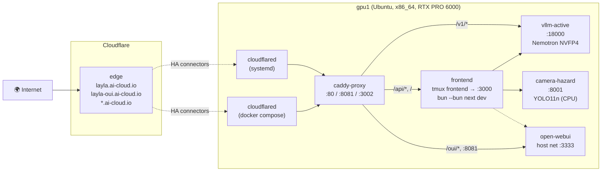

# Layla on gpu1 — Deployment Reference

**Host:** `gpu1` · Ubuntu 24.04 · x86_64 · Threadripper PRO 5965WX · 256 GB ECC · **RTX PRO 6000 Blackwell (97 GB VRAM)** · driver R610 / CUDA 13.3
**Public URL:** <https://layla.ai-cloud.io>
**Origin migration:** DGX Spark (aarch64) → gpu1 (x86_64) — see [Migration findings](#migration-findings--dgx-spark--gpu1) for the 4 vLLM gotchas the move surfaced.

---

## Architecture (live as of 2026-06-09)



Two cloudflared connectors hit the **same tunnel id** → Cloudflare load-balances; either can crash without dropping the public URL.

---

## Public hostnames

| Hostname | Tunnel ingress | Caddy listener | Backend |
|---|---|---|---|
| `layla.ai-cloud.io` | `http://localhost:80` | `:80` | `vllm-active:18000` for `/v1/*`, `host:3000` (frontend) for `/*` |
| `layla-oui.ai-cloud.io` | `http://localhost:8081` | `:8081` | `host.docker.internal:3333` (Open WebUI) |
| `*.ai-cloud.io` (wildcard) | `http://localhost:80` | `:80` | (catches anything else under the apex) |

(`layla-dev.ai-cloud.io` was dropped — no separate dev server runs.)

---

## Containers, services, and tmux sessions

All Docker containers have `--restart unless-stopped` ⇒ they come back automatically on `sudo reboot`. The systemd cloudflared unit is `enable`d ⇒ same. The **only** thing that does NOT auto-resume after a reboot is the **frontend tmux session** — re-run `run-frontend.sh`.

| Layer | Where | Port | Auto-restart | Restart command |
|---|---|---|---|---|
| vLLM (Nemotron NVFP4) | Docker `vllm-active` | host 18000 | ✅ unless-stopped | `docker restart vllm-active` |
| Caddy reverse proxy | Docker `caddy-proxy` | 80 / 8081 / 3002 | ✅ unless-stopped | `docker restart caddy-proxy` |
| Open WebUI | Docker `open-webui` | host 3333 | ✅ unless-stopped | `docker restart open-webui` |
| Camera hazard (YOLO) | Docker `camera-hazard` | host 8001 | ✅ unless-stopped | `docker restart camera-hazard` |
| Cloudflare tunnel (primary) | systemd `cloudflared` | — | ✅ enabled | `sudo systemctl restart cloudflared` |
| Cloudflare tunnel (HA) | Docker `cloudflared` (homelabs) | — | ✅ unless-stopped | `cd /home/charles/_charles/_github/charles-cai/homelabs/ubuntu/gpu1/cloudflared && docker compose restart` |
| Frontend (Next.js + Bun) | tmux `frontend` | host 3000 | ❌ manual | `bash ~/_charles/_github/hjklasdfg/layla/scripts/gpu1/run-frontend.sh` |

---

## Daily startup (cold or post-reboot)

```bash
cd ~/_charles/_github/hjklasdfg/layla/scripts/gpu1

./nemotron-nano-omni-30b-nvfp4.sh    # vLLM Nemotron NVFP4 (~3 min cold start, ~50 s warm)
./caddy.sh                           # Reverse proxy (idempotent — recreates the container)
./camera-hazard.sh                   # YOLO11n hazard service (idempotent — rebuilds if Dockerfile changes)
./run-frontend.sh                    # Next.js dev server in tmux

# Tunnel + Open WebUI are already auto-restarting (Docker / systemd)

# Quick health check
docker ps --filter "name=vllm-active" --filter "name=caddy-proxy" --filter "name=cloudflared" \
          --filter "name=open-webui" --filter "name=camera-hazard" \
          --format 'table {{.Names}}\t{{.Status}}\t{{.Ports}}'
sudo systemctl is-active cloudflared
curl -s https://layla.ai-cloud.io/v1/models | jq -r '.data[0].id'
```

---

## Repository layout

| Path | Owns |
|---|---|
| `scripts/gpu1/` (this dir) | Layla-specific application containers + tmux sessions |
| `/home/charles/_charles/_github/charles-cai/homelabs/ubuntu/gpu1/cloudflared/` | Cloudflare tunnel — apt install, systemd, docker compose, ingress |
| `~/_charles/_github/hjklasdfg/layla/frontend/.env.local` | Frontend secrets (TfL, Gemini, ElevenLabs, Nemotron base URL) — **gitignored** |
| `~/_charles/_github/hjklasdfg/layla/scripts/.env` | Cloudflare credentials + tunnel IDs — **gitignored**, sourced by `cloudflared/setup-tunnel.sh` |
| `~/.cloudflared/<tunnel_id>.json` | Per-tunnel secret (chmod 600) |
| `/etc/cloudflared/config.yml` + `<id>.json` | systemd connector config (root-owned) |

---

## Stand-down (after the hackathon)

Work top-down — frontend first so users see "service offline" before the backends actually shut, public URL last so curls in flight return cleanly.

### 1. Stop the frontend
```bash
tmux kill-session -t frontend
```

### 2. Stop the docker containers (any subset — they're all independent)
```bash
docker stop vllm-active caddy-proxy camera-hazard
# Open WebUI is shared infra — leave it unless you want it down too
```

For a clean wipe (removes containers but keeps images + the open-webui-data volume):
```bash
docker rm -f vllm-active caddy-proxy camera-hazard
```

### 3. Tear down the Cloudflare tunnel
```bash
# Docker HA leg
cd /home/charles/_charles/_github/charles-cai/homelabs/ubuntu/gpu1/cloudflared
docker compose down

# systemd primary leg
sudo systemctl stop cloudflared
sudo systemctl disable cloudflared
sudo cloudflared service uninstall      # removes the unit
```

Delete the tunnel from Cloudflare and remove DNS (so the hostname stops resolving):
```bash
set -a; source ~/_charles/_github/hjklasdfg/layla/scripts/.env; set +a
# delete tunnel
curl -sS -X DELETE \
  "https://api.cloudflare.com/client/v4/accounts/${CLOUDFLARE_ACCOUNT_ID}/cfd_tunnel/${TUNNEL_ID}" \
  -H "Authorization: Bearer ${CLOUDFLARE_API_TOKEN}" | jq '{success, errors}'
# delete the CNAMEs
for host in layla.ai-cloud.io layla-oui.ai-cloud.io; do
  RID=$(curl -sS "https://api.cloudflare.com/client/v4/zones/${CLOUDFLARE_ZONE_ID}/dns_records?type=CNAME&name=${host}" \
        -H "Authorization: Bearer ${CLOUDFLARE_API_TOKEN}" | jq -r '.result[0].id // empty')
  [ -n "$RID" ] && curl -sS -X DELETE \
    "https://api.cloudflare.com/client/v4/zones/${CLOUDFLARE_ZONE_ID}/dns_records/${RID}" \
    -H "Authorization: Bearer ${CLOUDFLARE_API_TOKEN}" | jq '{success}'
done
```

### 4. Optional cleanup
```bash
# Free the ~100 GB of vLLM compile + HF caches
rm -rf ~/.cache/vllm-compile ~/.cache/huggingface/hub/models--nvidia--Nemotron-3-Nano-Omni-30B-A3B-Reasoning-NVFP4

# Drop the docker images (~20 GB)
docker image rm vllm/vllm-openai:latest-cu130-ubuntu2404 caddy:alpine camera-hazard:latest \
                cloudflare/cloudflared:latest ghcr.io/open-webui/open-webui:main

# Revoke the Cloudflare token from the dashboard:
#   https://dash.cloudflare.com/profile/api-tokens   →  Roll / Delete
```

`scripts/.env` and `frontend/.env.local` are gitignored — they can stay on disk safely, or `shred -u` them once the token is revoked.

### What stays untouched on gpu1

- `open-webui`, `komodo-*`, `mnist_*`, `tailscale-*` — pre-existing, **not Layla-owned**, leave alone
- Docker volumes `open-webui-data`, `mnist_postgres` — not Layla-owned

---

## Scripts in this directory

| Script | Role |
|---|---|
| `nemotron-nano-omni-30b-nvfp4.sh` | Launch vLLM with Nemotron NVFP4 (~21 GB weights, ~29 GB VRAM with 131k ctx). |
| `nemotron-nano-omni-30b-bf16.sh` | Launch BF16 reference (~60 GB) on a different port for quality A/B. |
| `caddy.sh` + `Caddyfile` | Reverse proxy — `/v1` → vLLM, `/oui` → OUI, `/` → frontend. |
| `open-webui-config.sh` | Re-deploy OUI on `vllm-net` pointing at our Nemotron. (Optional — existing OUI on host:3333 already works.) |
| `camera-hazard.sh` | Build + run the YOLO11n hazard service on :8001 (CPU device). |
| `run-frontend.sh` | Next.js (`bun --bun next dev`) in tmux session `frontend`, bound to `0.0.0.0:3000`. |

**Cloudflare tunnel** (`install-cloudflared.sh` / `setup-tunnel.sh` / `service.sh` / `docker-compose.yml`) lives separately in the homelabs repo at
`/home/charles/_charles/_github/charles-cai/homelabs/ubuntu/gpu1/cloudflared/`.

---

## Environment files

`frontend/.env.local` (gitignored). Key vars wired up:

```
TFL_APP_KEY=…                       # required — TfL Unified API
LLM_PROVIDER=nemotron
NEXT_PUBLIC_LLM_PROVIDER=nemotron
NEMOTRON_BASE_URL=https://layla.ai-cloud.io
NEMOTRON_MODEL=nvidia/Nemotron-3-Nano-Omni-30B-A3B-Reasoning-NVFP4
GEMINI_API_KEY=…                    # cloud fallback for plan
ELEVENLABS_API_KEY=…                # voice STT/TTS
NEXT_PUBLIC_VOICE_ENABLED=true
BACKEND_API_URL=                    # blanked on purpose — frontend uses in-process Nemotron planner
CAMERA_HAZARD_FAKE_LOOP=false
CAMERA_HAZARD_API_URL=http://localhost:8001
LAYLA_NEMOCLAW_AUTO_START=false     # NemoClaw hazard agent disabled (OOM history)
```

`scripts/.env` (gitignored). Set by `setup-tunnel.sh` + manually:

```
CLOUDFLARE_API_TOKEN=cfut_…              # Tunnel:Edit + DNS:Edit + Zone:Read
CLOUDFLARE_ACCOUNT_ID=2bcd6cbc70fa4a22af217bc4042bfae9
CLOUDFLARE_ZONE_ID=2957807d79a57f1a4f8887a1db7c6e70
TUNNEL_ID=6a935a53-0658-43e7-a388-1ec1c424b991
TUNNEL_NAME=layla-hackathon
TUNNEL_HOSTNAME=layla.ai-cloud.io
GATEWAY_URL=https://layla.ai-cloud.io
```

---

## Performance — measured on this deployment

NVFP4, Marlin MoE, 131k ctx, fp8 KV (`llama-benchy 0.3.7`, 2 runs, pp=512 tg=256):

| Test | Throughput | TTFT |
|---|---|---|
| Generation, c=1 | **~301 tok/s** | n/a |
| Generation, c=4 (aggregate) | **~691 tok/s** (~207/user) | n/a |
| Prefill, c=1 (512-token prompt) | ~11 000 tok/s | **72 ms** |
| Prefill, c=4 | ~9 300 tok/s | 347 ms |
| Per-token decode latency | 25.4 ms | — |

Result CSV: `~/_charles/_github/charles-cai/dev-notes/gpu/vllm/llama-benchy/results/`

---

## Migration findings — DGX Spark → gpu1

Background: original deployment ran on DGX Spark (GB10 Grace Blackwell, ARM64, 128 GB unified) with `vllm/vllm-openai:v0.20.0-aarch64-cu130-ubuntu2404`. Moving to gpu1 (RTX PRO 6000, x86_64) hit four issues — all worth knowing:

### Pre-existing state on gpu1

Two **dead Qwen vLLM containers** were stuck in `--restart unless-stopped` loops:

| Container | RestartCount | Root cause |
|---|---|---|
| `vllm-active` (Qwen3.6-35B-A3B-FP8) | **1762** | Engine core init failed every boot |
| `vllm-35b`    (Qwen3.6-35B-A3B-FP8) | **1153** | `unrecognized arguments: Qwen/...` (old CLI) |

The host showed "memory goes up, flatlines, then up again" — that's the docker restart cycle. Removed with `docker rm -f`. VRAM dropped from 38 GB to ~640 MiB.

### Issue 1 — `--chat-template-kwargs` was renamed

The amd64 `latest-cu130-ubuntu2404` build (self-reports `version 0.20.0`) renamed the flag:

```diff
- --chat-template-kwargs '{"enable_thinking": false}'
+ --default-chat-template-kwargs '{"enable_thinking": false}'
```

Symptom: `vllm: error: unrecognized arguments: --chat-template-kwargs ...`.

### Issue 2 — `--moe-backend triton` is **not valid for NVFP4**

The vLLM recipe[¹] says "use triton on RTX Pro due to FlashInfer compatibility issues" — but that's for the **non-NVFP4** variant. NVFP4 MoE explicitly errors:

```
ValueError: moe_backend='triton' is not supported for NvFP4 MoE.
Expected one of ['cutlass','flashinfer_trtllm','flashinfer_cutlass','flashinfer_cutedsl','marlin','emulation'].
```

On Blackwell, FlashInfer fails at dispatch, so the path that works is `--moe-backend marlin`.

### Issue 3 — `--reasoning-parser nemotron_v3` swallows `.content`

With `enable_thinking=false` the model emits no `<think>` blocks, but the parser still routes everything to `.message.reasoning`, leaving `.content = null` — every OpenAI-spec client (including the Layla frontend's fetch) breaks. We dropped `--reasoning-parser` entirely.

### Issue 4 — pinning vs `latest`

`vllm/vllm-openai:latest-cu130-ubuntu2404` currently resolves to v0.20.0 on amd64 but with the flag renames from Issue 1. Pin if you need reproducibility:

```bash
VLLM_IMAGE=vllm/vllm-openai:v0.20.0-cu130-ubuntu2404 ./nemotron-nano-omni-30b-nvfp4.sh
```

[¹]: <https://docs.vllm.ai/projects/recipes/en/latest/NVIDIA/Nemotron-3-Nano-30B-A3B.html>

---

## Hardware notes

- **GPU**: NVIDIA RTX PRO 6000 Blackwell · 97 GB GDDR7 · SM_120
- **NVFP4** weights load in ~4 s from a fast NVMe; CUDA graph capture takes ~10 s
- **Cold start**: ~3 minutes to "Application startup complete" (first download + compile)
- **Warm restart**: ~50 s (compile cache in `~/.cache/vllm-compile`)
- **VRAM at idle**:
  - NVFP4 + 131k ctx + `--gpu-memory-utilization 0.55`: ~29 GB
  - BF16  + 131k ctx + `--gpu-memory-utilization 0.85`: ~75 GB (KV cache dominates — drop `--max-model-len` to 32k for BF16 experiments)

---

## Security posture

- The Layla repo is **public**; `scripts/gpu1/` contains no secrets. All keys are env-var references.
- `frontend/.env.local` and `scripts/.env` are in `.gitignore` and live only on gpu1.
- Cloudflare tunnel credentials: `~/.cloudflared/<id>.json` and `/etc/cloudflared/<id>.json` are chmod 600.
- The current Cloudflare token is a `cfut_…` user token scoped to: `Cloudflare Tunnel:Edit`, `DNS:Edit`, `Zone:Read` on the `ai-cloud.io` zone.
- No exposed admin endpoints — the public URL talks only to `/v1`, `/api/*`, `/oui/*`. The Caddy host-network bridge means containers reach each other inside `vllm-net`.

---

## Cross-references

- Deeper dev notes (kept on gpu1): `/home/charles/_charles/_github/charles-cai/dev-notes/gpu/vllm/nemotron-3-nano-omni-30b-nvfp4.md`
- Original DGX scripts: `../dgx/`
- Cloudflare tunnel scripts: `/home/charles/_charles/_github/charles-cai/homelabs/ubuntu/gpu1/cloudflared/`
- Benchmark harness: `/home/charles/_charles/_github/charles-cai/dev-notes/gpu/vllm/llama-benchy/`
